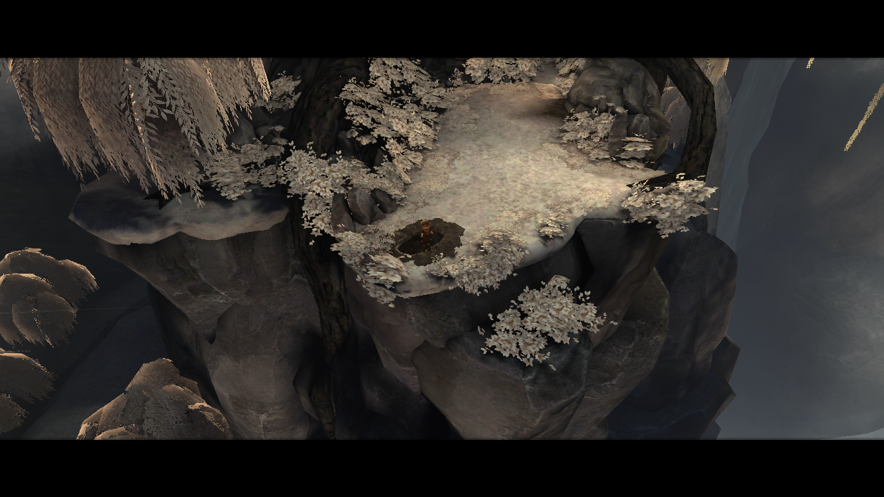

#兄弟：双子传说
《兄弟：双子传说》（以下简称《兄弟》）是一款3D解谜类游戏，PC、PS、switch、ios平台都能购买到，笔者入手的是ios端，6RMB。游戏大概讲的是一对兄弟为了生病的父亲踏上寻找"生命之水"的路途。

还是先说说游戏画面（没办法，颜控本控了¯\_(ツ)_/¯）。作为一款3d手游来说，画面制作还是很用心的。个人认为玩家在3d游戏中，相比2d游戏更有机会体验到"宏伟感"（譬如《journey》就将这种优势发挥地淋漓尽致），而《兄弟》为了让玩家更极致地领略游戏中的景色风光也是动了小心机：在场景中的一些制高点特地安设了瞭望区，玩家坐在长椅上尽可以感受遥望远山、俯瞰村庄的"一览众山小"之感。游戏标志性带有吟唱的大气的配乐更是和这种"宏伟感"相得益彰了。 

 

    

个人觉得如果是雪山应该会更好看hhh
 
游戏场景的美工不错，但是人物（包括颜值担当蜘蛛精）真的都很吃藕，我甚至觉得人物身材比例都有点问题……就不贴特写了(°_°)。除此之外，不知道是游戏画风偏写实的原因还是因为美工人员为了搭配剧情特意为之，《兄弟》的画面从头至尾都给我一种灰蒙蒙的感觉，对于我个人而言，可能会更喜欢像《回忆之旅》那样小清新一点的画面哈哈哈，不过不可否认《兄弟》确实带给我不少视觉上的享受，优秀(￣∇￣)！  

当然，作为一款解谜冒险类游戏，他也做好本职工作精心设计了游戏玩法。首先左右同时操控哥哥和弟弟的玩法就挺不落俗套（然而同时控制两个人物不是很好操作，据说PS可以双人游戏）；并且游戏谜题设计也很优秀，虽然解谜难度不大（我没有看攻略就通关了），但是玩法很多样：一路上，兄弟俩要横渡大江大河，要徒手攀上悬崖峭壁，要划船，要开飞机，要跟小混混斗智斗勇，也要解救被困少女，要躲野狼野狗隐形雪怪，但也能坐在山兽和飞鸟身上走遍山川河海……另外还加入了很多和环境以及npc的互动，这些互动尤其有趣（轻微剧透）：几乎每个NPC哥哥和弟弟和他们的互动都不一样，哥哥会认真问路，而弟弟会嘻嘻哈哈跟他们开玩笑；碰到死去的动物或者人物，兄弟俩都会静立默哀；面对水井，哥哥会好奇地端详水井，弟弟则会往里面吐口水；遇到鲜花，哥哥会陶醉般地感受花香，弟弟则会一巴掌把花盆打碎在地；在路上遇到玩皮球的小女孩，如果弟弟捡起皮球扔到很远处，然后哥哥跑去捡回来，则会达成“给弟弟作出表率”的成就，如果把皮球扔到井里，则会达成“许愿灵井”成就，然后小女孩会蹲在地上抽泣；在不同关卡找到两只关在笼子里的鸟并，则会达成“爱情鸟”成就……诸多细节可以看出来制作组真的超级用心。总之几个小时的游戏体验一定不会让玩家觉得无聊，不管从画面还是玩法来说，每一关都有让人眼前一亮的环节。

  

我觉得超美的一个景色

《兄弟》最出彩的部分毋庸置疑是剧情了，很多玩家建议可以加上多结局，但个人认为单一结局更能突显游戏主题，多结局反而会让剧情减分吧。这是一款很能打动人心的游戏，不管是从主线剧情还是一些小的分支剧情来说。

（既然提到剧情那就要剧透警告了，介意的朋友可以拖到最后看游戏整体评价）

主线剧情在文章开头已经介绍了，其实找“生命药水”倒不是重点，而是俩兄弟的情谊和弟弟的不断成长。剧情的高潮部分在游戏结尾：哥哥被蜘蛛精刺伤后奄奄一息，仍催促弟弟爬到树上取“生命药水”，在弟弟爬树的过程中，属于哥哥的蓝色按钮随着哥哥心跳的逐渐变缓变弱而渐渐变淡、最终消失，弟弟回到树下却发现哥哥已经离开了人世，最终还不得不亲手掩埋哥哥的遗体。我操控着弟弟往树上爬时，听到逐渐放慢的“咚咚”的心跳都不忍心继续往上走，想哥哥能多留一会儿是一会儿（捂脸），后来弟弟抽泣着有气无力地掩埋哥哥的时候，也是很令人痛心的。最终弟弟乘飞鸟回家，飞行途中俯瞰来时的路途，让玩家不禁回想起与哥哥相处的种种情景：载着怕水的弟弟渡过河流，在弟弟够不着高度的时候将弟弟托到高处……

 

弟弟站在哥哥坟墓前最后的凝望

本以为到此就游戏结束了，但最后飞鸟仅仅将弟弟送到了山脚下，而家在山顶上，弟弟还得在瓢泼大雨中独自走一段路，在这一段路中，哥哥的按钮会以灰色重新出现在游戏界面，在弟弟遇到河流时，按下哥哥的按钮，他会鼓励弟弟克服心理障碍学会游泳，遇到曾经扳不动的操纵杆和够不着的悬梯时，哥哥都会在精神上鼓舞着弟弟超越曾经的自己，最终成功将“生命药水”递给了病中的父亲……在游戏最后，如果你操控弟弟与房子外的花盆进行互动，你会发现曾经为了好玩只会摔碎花盆的弟弟，现在也不再顽皮，而是会像哥哥一样静静嗅着花香（这细节真的绝了）。

 

飞鸟驮着弟弟飞过来时的山川河流

我觉得游戏收场白的这一段的设计是极妙的，在经历了路途的艰难险阻和哥哥的离去，弟弟不再像当年一样幼稚与软弱，他不仅可以独当一面了，还多多少少继承了哥哥的性格，或许对于很多玩家来讲，也算是对于哥哥意外离世的一种补偿和慰藉。

其实现实中又何尝不是如此？没有哪一位亲人能够陪伴我们到永远，我们只会相伴走过人生的某一段路，当不得不说再见时，我们也一定能有所收获与成长，以一种更加成熟的姿态继续接下来的人生，而离去的他们则会永驻心间，成为我们前行路上的铠甲。  

除了主线剧情，一些支线剧情也很值得回味：弟弟怕水的原因是因为母亲当年在一次事故中溺亡，而弟弟无能为力没有救起母亲；最初阻挠兄弟俩人道路的小混混到最后被恶狗逼到墙角，反遭嘲笑；悬崖边的巨人一直在哭泣，原来是因为被抓走的妻子，他虽然外貌可怖，吓坏了俩兄弟，却有一颗善良温暖的内心，帮助兄弟俩翻越峭壁，并最终在兄弟俩的帮助下解救了妻子；路途中遇到一个自缢的人，兄弟俩救下他后发现他自杀是因为家人都丧生于火灾……整体而言，《兄弟》是引导玩家向善和发现爱的，很正的一款游戏哈哈哈。

母亲和哥哥的墓碑

对于剧情我只有一个不太喜欢的地方：兄弟俩拼命救下的被当作祭品的少女竟是蜘蛛精化身并最终杀死了哥哥，我在看到蜘蛛精拉起哥哥的手一起走时天真地以为哥哥遇见了爱情，然而emmmm…… 我觉得如果这里顺理成章地穿插一点有关爱情的情节，让哥哥丧命于另外的原因，或许会使剧情更丰富一点。

 

不少玩家呼吁这里可以自行选择跟不跟“少女”进山洞

游戏的画面、剧情、配音、配乐，都给游戏蒙上一层魔幻现实主义滤镜。 虽然灰蒙蒙的画面和剧情上的惊悚成分（只有一点点一点点一点点）给了我一种压抑感（也有可能是因为我是熬夜玩的这款游戏……），但其实游戏内核是充满温情的，并且相对于其他优点，就更瑕不掩瑜了。 6RMB包含这么丰富的游戏内容（不然也写不了这么长一篇评论ಥ_ಥ）可以说是很值了，买它(((o(*ﾟ▽ﾟ*)o)))！

