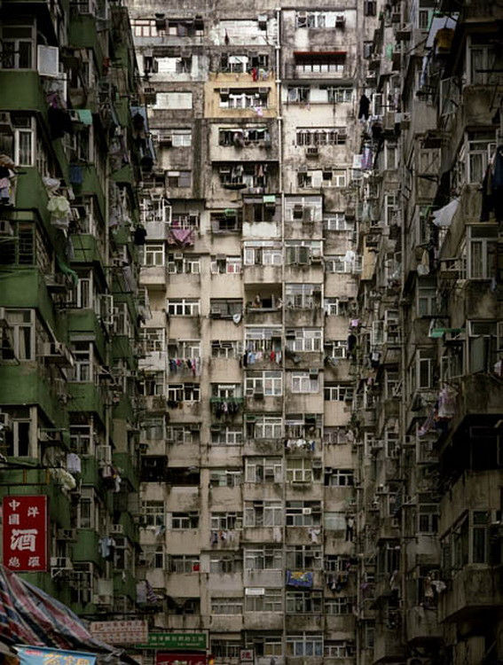

#南瓜先生2：九龙城寨
  

《南瓜先生2：九龙城寨》（以下简称《九龙城寨》）是国内独立游戏工作室胖布丁游戏制作的南瓜先生系列解谜游戏的续集。《九龙城寨》讲述的是南瓜先生误入香港著名平民窟：九龙城寨后寻找神龙逃离的故事。   

九龙城寨，经常被很多赛博朋克影片当做是标志性场景的，是香港历史上真实存在过的地点，曾是亚洲最大的贫民窟，是肮脏、混乱、荒淫、罪恶的代言词，甚至一度被贴上"想要命就别进来"的标签。城寨中所有住户共用仅仅几个水龙头、黑牙医诊所、充满血污的屠宰铺、老年活动中心……这些真实存在于九龙城寨中的场景和情节在游戏中都被以另一种风格呈现。在这款游戏中，我们可以跟随方脑袋南瓜先生，以一个平民的视角，走进九龙城寨，走近各式各样的居民们，感受这座围城里的人间冷暖、酸甜苦辣。

   

现实中的九龙城寨

（严重剧透警告，想看画面、游玩性评价请直接移步文章末尾(#ﾟДﾟ)）  
游戏中