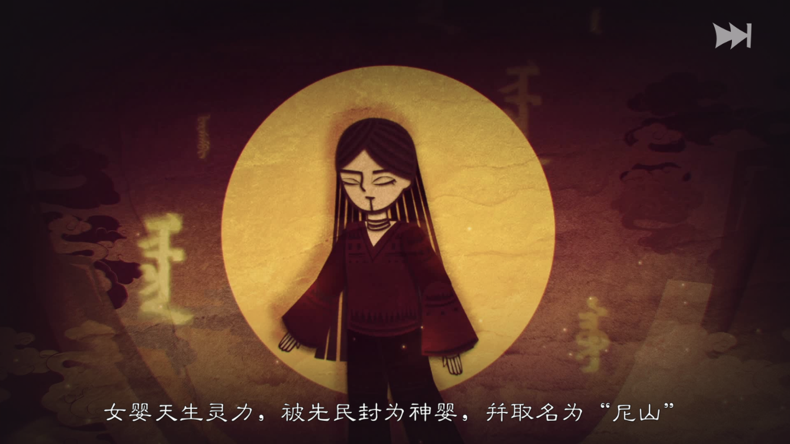
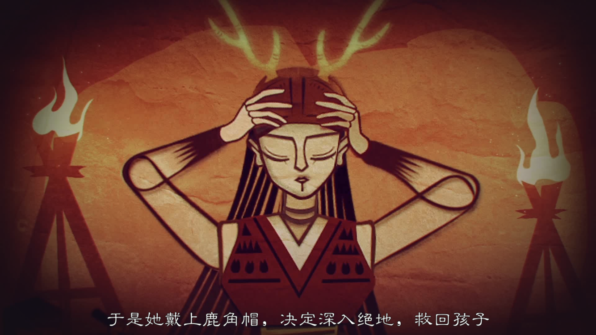
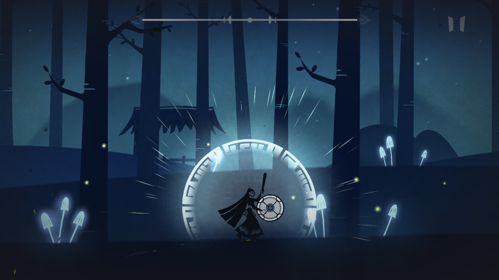
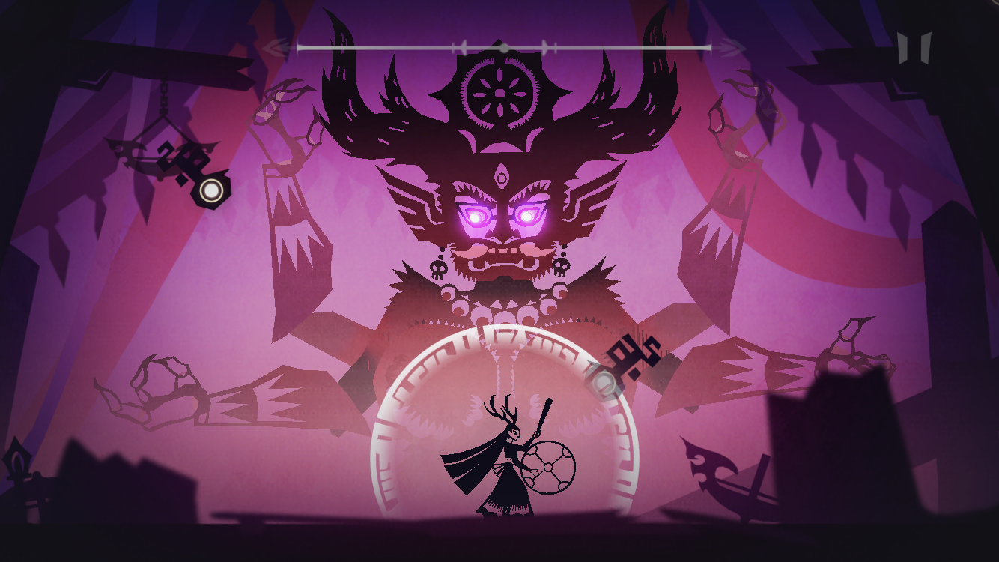

# 尼山萨满
原来腾讯的游戏也能这么良心（误）。

 

一款出自六位毕业生之手的绝美音游，纯免费！游戏改编自我国北方少数民族传说——《尼山萨满传》，讲述的是神女尼山解救被鬼神掳走灵魂的小孩的故事。

 因为自己对于少数民族文化一直很感兴趣，所以入手这款游戏就完全是冲着"尼山萨满"这个标签，上手之后发现游戏不仅很好地诠释了"国风"和"民族特色"，从音乐和美术上来讲，也绝对是一场不可错过的视听盛宴。

刚进入游戏时，悠扬、极具民族特色的背景音乐、皮影风格的画面（不过制作组解释说是剪纸风）、开场动画里的满语解说都完美地渲染了游戏主题风格，给人以耳目一新的感觉。满语配音我最开始以为就是乱念一通，最后发现制作组还专门邀请了满语配音，游戏的每一个收藏图鉴下方都给出了来源和简要介绍，很有诚意。

《尼山萨满》如果作为一款音游，应该说在玩法上略有欠缺，一是难度过小关卡过少，二是缺少传统音游的一些基本要素：比如分数统计、击中反馈等等。不过对于几乎不玩音游的玩家比如我来说，这些问题倒是无关紧要的。玩家在点击屏幕时会发出击鼓声，这个鼓声搭配乐曲真的超酷超带感，感觉自己瞬间化身在黄土高坡打安塞腰鼓拉风的一员（学过这篇课文的朋友或许能理解我的感受），由玩家正确按照节奏给出的击鼓声完美与背景音乐结合，赋予了玩家很强的代入感。 我认为这一点是市面上其他很多音游所不具备的。

不过我阅读了知乎上几位开发人员的的回答，了解到削弱"音游性质"是特意而为之，之前出过更贴近传统音游的版本，但觉得效果并不算好，他们想带给玩家更多沉浸式体验，不被固定音游模式所限制从而更多关注游戏的画面、音乐、和剧情。不得不承认，这样的调整的确带给了玩家很好的体验，不管怎样，我在游玩的过程中着实被游戏美术与配乐深深打动。相较之下，deemo更侧重音游的操作，游戏背景十分简洁，让玩家能集中精力于节奏和操作，相应的，游戏难度更大，乐曲库也更丰富。这应该是音游内核衍生出的不同侧重点，各有千秋（dancing line又完全是另一种风格了）。  

不过游戏的小trick:我第一次通关时有一个"所有章节获得优秀，达成完美结局"的成就没完成，我重复玩了好多遍就是想看看完美结局是什么，结果全优之后还是一样的结局，有点略失落（捂脸）。  
在笔者看来，《尼山萨满》的唯一"缺点"就是难度太低、关卡太少、叙事过短，作为音游菜鸡的我都能半小时通关、两小时达成全部成就。说白了就是期盼着制作组能出续集（暴风哭泣），这样的良心手游完全可以收费，不亏。！